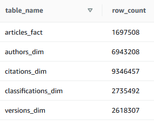

# ArXiv Metadata ETL Pipeline with Airflow


This repository contains the capstone project submission for the [Udacity Data Engineering Nanodegree](https://www.udacity.com/course/data-engineer-nanodegree--nd027). 

The project uses the following concepts:
* Building a data pipeline using [Apache Airflow](https://airflow.apache.org/)
* Loading data for processing from [Amazon S3](https://aws.amazon.com/S3/) and saving processed data to [Amazon Redshift](https://aws.amazon.com/redshift/)
* Loading Airflow and running the DAG locally through [Docker](https://www.docker.com/)


# Context 

[ArXiv](https://arxiv.org/) is a free distribution service and an open-access archive for more than 1.5MM scholarly articles in the fields of physics, mathematics, computer science, quantitative biology, quantitative finance, statistics, electrical engineering and systems science, and economics. arXiv is a collaboratively funded, community-supported resource founded by [Paul Ginsparg](https://en.wikipedia.org/wiki/Paul_Ginsparg) in 1991 and maintained and operated by [Cornell University](https://www.cornell.edu/). *(Description from kaggle)*

In this project, we will need to load [metadata from ArXiv](https://www.kaggle.com/Cornell-University/arxiv) from S3, process the data into analytics tables on Redshift, and verify data integrety using tests. 
We implement this process using Apache Airflow.


## Plan of attack

```
Assets
	[All assets needed for README]
Airflow
	[Dags]
	[Plugins]
	docker-compose.yml
	requirements.txt
Data
	[Empty initially]
Exploration
	[Notebooks to explore data in Data folder]
Setup
	[Download script OR README for how to download all needed data from Kaggle + ArXiv website]
	[Script for loading all data to S3]
	[Script for adding variables/connections/users to Airflow]
	[misc setup scripts needed]
config.cfg
README.md
```

### TODO

```
Load data from sources to disk
	Source 1: Kaggle (download .json files)
	Source 2: ArXiv homepage (scrape using Python to .csv files)
Load data from disk to S3
Run empty airflow
Add connections/variables/users to airflow
Load and transform data from S3 into Redshift/Postgres using Airflow
Create quality checks for staged and transformed data
Deleted/moved unneeded files for the project
Updated doc-strings all around
Updated this README to reflect project files, setup and execution
```

### Setup:

```
	Fill in information in ./setup/aws.cfg
	Create user on Kaggle and add username and key to ~/.kaggle/kaggle.json

	From airflow folder:
		>>> docker-compose up -d

	From setup folder:
		>>> .\add_airflow_connections.ps1
		>>> python .\download_datasets.py
		>>> python .\load_to_s3.py
		>>> python .\create_redshift_cluster.py

	From Airflow web:
		Enable and run the DAG

	To shut it down again, from setup folder:
		>>> python .\terminate_redshift_cluster.py (note: this removes all data from Redshift as well)

	To shut it down again, from airflow folder:
		>>> docker-compose down
```

## Final results in main tables:



