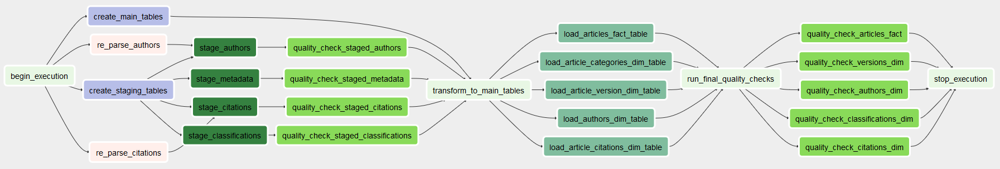
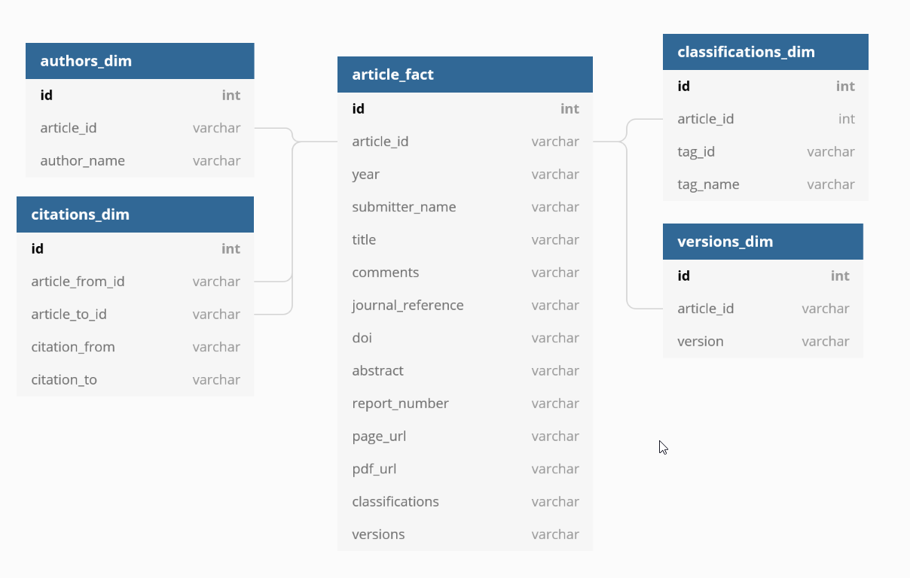

# ArXiv Metadata ETL Pipeline with Airflow


# Purpose

This repository contains the capstone project submission for the [Udacity Data Engineering Nanodegree](https://www.udacity.com/course/data-engineer-nanodegree--nd027). 

The project uses the following concepts:
* Building a data pipeline using [Apache Airflow](https://airflow.apache.org/)
* Loading data for processing from [Amazon S3](https://aws.amazon.com/S3/) and saving processed data to [Amazon Redshift](https://aws.amazon.com/redshift/)
* Loading Airflow and running the DAG locally through [Docker](https://www.docker.com/)

## Rationale for the choice of tools and technologies for the project

TODO


# Context 

[ArXiv](https://arxiv.org/) is a free distribution service and an open-access archive for more than 1.5MM scholarly articles in the fields of physics, mathematics, computer science, quantitative biology, quantitative finance, statistics, electrical engineering and systems science, and economics. arXiv is a collaboratively funded, community-supported resource founded by [Paul Ginsparg](https://en.wikipedia.org/wiki/Paul_Ginsparg) in 1991 and maintained and operated by [Cornell University](https://www.cornell.edu/). *(Description from kaggle)*

In this project, we will need to load [metadata from ArXiv](https://www.kaggle.com/Cornell-University/arxiv) from S3, process the data into analytics tables on Redshift, and verify data integrety using tests. 
We implement this process using Apache Airflow.

## How often the data should be updated and why?

TODO


# Project Structure

|Filename|Description|
|---|---|
|[assets](./assets/)| Assets folder containing images displayed in the README. |
|[airflow](./airflow/)| Airflow folder containing all needed files (docker-compose, DAGs, plugins, etc.) used by Airflow. |
|[data](./data/)| Data folder, initially empty with exception of a README. Data will be loaded into this folder before being moved to S3. |
|[exploration](./exploration/)| Explorative Jupyter Notebooks for exploring data and setup
|[setup](./setup/)| Folder containing all scripts for setting up the project, downloading data and loading this to S3, setting up AWS infrastructure (Redshift) and adding connections to Airflow programmatically. |
|[.gitignore](./.gitignore)| All the things that should NOT be committed to Git. |
|[LICENSE](./LICENSE)| In case anyone wants to re-use stuff from this repository. |
|[README.md](./README.md)| This file, descriping the repository and the content. |


# How to run 

## Execute locally

### Setup Configurations 

1) Follow the [setup guide](./setup/README.md).
2) Verify you Airflow running in docker, data loaded to S3, and a Redshift cluster running.

### Running

1) Go to ```http://localhost:8080/admin/``` in your browser
2) Enable ```arXiv_Redshift_dag``` and it will auto-start


# ArXiv DAG Pipeline

## Overview of ArXiv Airflow pipeline:



| Step | Type | Description |
| --- | --- | --- |
| begin_execution | DummyOperator | Dummy task with no action |
| create_staging_tables,<br/>create_main_tables | RedshiftExecuteSQLOperator |  Creates staging and main tables if not already exists, otherwise drops and re-create the table |
| re_parse_authors,<br/>re_parse_citations | PythonOperator | Downloads and parses JSON files, then saves them in another JSON format to be able to leverage Redshifts COPY functionality |
| stage_authors,<br/>stage_metadata,<br/>stage_citations,<br/>stage_classifications | StageFromS3ToRedshiftOperator | Loads data from S3 into staging tables using COPY functions |
| quality_check_staged_metadata,<br/>quality_check_staged_authors,<br/>quality_check_staged_citations,<br/>quality_check_staged_classifications | DataQualityOperator | Runs quality checks and validation scripts on staged data |
| stage_to_main_tables | DummyOperator | Dummy task with no action |
| load_articles_table,<br/>load_article_version_dimension_table,<br/>load_article_authors_dimension_table,<br/>load_article_classifications_dimension_table,<br/>load_article_citations_dimension_table | LoadRedshiftTableOperator | Transforms and loads data from staging tables into main tables |
| run_data_quality_checks | DummyOperator | Dummy task with no action |
| quality_check_articles_fact,<br/>quality_check_versions_dim,<br/>quality_check_authors_dim, quality_check_classifications_dim,<br/>quality_check_citations_dim | DataQualityOperator | Runs quality check on data loaded into main dimensional tables and fact table |
| End_execution | DummyOperator |  Dummy task with no action |

## Loading data from S3

The process reads data from S3, using the specifiers: 

* Metadata data: s3://arxiv-etl/metadata
* Authors data: s3://arxiv-etl/authors/authors-parsed.json
* Citations data: s3://arxiv-etl/citations/citations_parsed.csv
* Classifications data: s3://arxiv-etl/classifications

## Data Processing

Data loaded from S3 is processed and transformed into five main Fact and Dimensional tables in your Redshift cluster:



## Final row counts for denormalized data in main tables:

<!--  -->

| Table name | Row count |
| --- | --- |
| articles_fact | 1.697.508 |
| authors_dim | 6.643.208 |
| citations_dim | 9.346.457 |
| classifications_dim | 2.735.492 |
| versions_dim | 2.618.307 |

## Quality Checks

TODO


# Scenarios 

## How you would approach the problem differently under the following scenarios

### The data was increased by 100x.
    
* Increase the size of the current Redshift Cluster. For this project I have 2 nodes in a cluster with combined 320 GB of storage. This can easily be scaled both vertically and horizontally, both to increase the individual node, as well as adding more nodes to the cluster.

###  The data populates a dashboard that must be updated on a daily basis by 7am every day.

* This should be created as a seperate Airflow DAG from the one in this project, that loads from S3. This new DAG should be created to update the dashboard, with a SLA for completing the task no later than 7:00 AM.

### The database needed to be accessed by 100+ people.

* I feel that with the current setup of leveraging a Redshift cluter, this is already possible. Again, as in the first scenario, it might require that the cluster is scaled to a larger size than currently.
